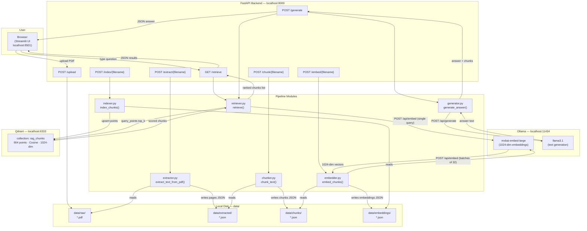

# RAG Pipeline — Architecture

**Last updated:** Step 10 — Generate answer from retrieved chunks

This diagram shows every component that has been built so far.
It is a living document — updated at each finalization step if the architecture changed.

---

## Full System Data Flow



---

## Component Summary

| Component | Technology | Role |
|-----------|-----------|------|
| Streamlit UI | `ui/app.py` | User-facing question input and chunk results display |
| FastAPI backend | `app/main.py` | REST API — orchestrates all pipeline steps |
| extractor.py | PyMuPDF (fitz) | Converts PDF pages to plain text JSON |
| chunker.py | Custom (200-word / 50-word overlap) | Splits page text into overlapping windows |
| embedder.py | Ollama `/api/embed` | Produces 1024-dim vectors per chunk |
| indexer.py | Qdrant client | Upserts vectors + metadata into Qdrant |
| retriever.py | Qdrant `query_points` | Embeds query, fetches top-k nearest chunks |
| generator.py | Ollama `/api/generate` | Builds grounding prompt, calls LLM, returns answer |
| Ollama | `mxbai-embed-large` + `llama3.1` | Local embedding model and local LLM |
| Qdrant | Docker `qdrant/qdrant` | Vector database, collection `rag_chunks` |
| Disk storage | `data/{raw,extracted,chunks,embeddings}/` | Intermediate JSON artefacts per step |

---

## Data Artefacts

```
data/
├── raw/              ← uploaded PDFs
├── extracted/        ← [{page: N, text: "..."}] per PDF
├── chunks/           ← [{chunk_index, page, text}] per PDF
└── embeddings/       ← [{chunk_index, page, text, embedding: [f×1024]}] per PDF
```

---

## What is NOT built yet (next steps)

- Chunk-level citations shown in the UI (Step 11)
- Soft refusal when evidence score is too low (Step 12)
- Conversation memory / multi-turn (future)
- Semantic cache (future)
- Hybrid retrieval / reranker (future)
