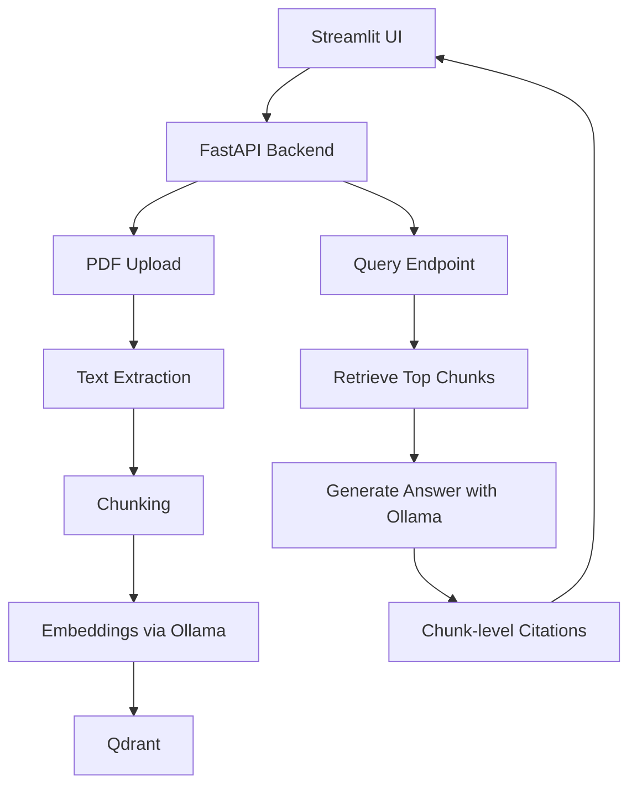

# Learning Path — Build the RAG System in Tiny Steps

This is the canonical step order for the project.

---

## [x] Step 0 — Project skeleton only (`tag: step-00`)
- create minimal folders
- add `pyproject.toml`
- add `.env.example`
- add `README.md`
- no RAG logic yet

## [x] Step 1 — Health-only FastAPI app (`tag: step-01`)
- create FastAPI server
- add `/health/live`
- run locally
- verify server boots

## [x] Step 2 — Minimal Streamlit UI shell (`tag: step-02`)
- create Streamlit app
- add title, text box, placeholder response area
- connect to backend health endpoint only

## [x] Step 3 — PDF upload endpoint (`tag: step-03`)
- add FastAPI endpoint to accept one PDF file
- save uploaded PDF locally in `data/raw/`
- return file metadata

## [x] Step 4 — Extract text from a text PDF (`tag: step-04`)
- read uploaded PDF
- extract page text
- store extracted pages as JSON
- no chunking yet

## [x] Step 5 — Chunk extracted text (`tag: step-05`)
- split pages into chunks
- preserve page numbers
- save chunk JSON locally

## [x] Step 6 — Generate embeddings locally with Ollama (`tag: step-06`)
- call local embedding model
- generate one vector per chunk
- save vectors + chunk metadata

## [x] Step 7 — Add Qdrant and index chunks (`tag: step-07`)
- start local Qdrant
- create collection
- upsert chunk vectors + metadata

## [x] Step 8 — Retrieval-only endpoint (`tag: step-08`)
- query embeddings
- retrieve top-k chunks from Qdrant
- return retrieved chunks only
- no generation yet

## [x] Step 9 — Show retrieval results in Streamlit (`tag: step-09`)
- ask question from UI
- show retrieved chunks and scores
- no answer generation yet

## [x] Step 10 — Generate answer from retrieved chunks (`tag: step-10`)
- call Ollama LLM
- answer only from retrieved context
- show answer in API response

## [x] Step 11 — Add chunk-level citations (`tag: step-11`)
- attach chunk ids, page numbers, source file to answer
- show citations in UI

## Step 12 — Refuse when evidence is weak
- simple retrieval-confidence heuristic
- safe fallback answer when evidence is insufficient

## Step 13 — Conversation memory (small)
- keep last N turns in Streamlit session + backend memory object
- rewrite simple follow-up query into standalone form

## Step 14 — Semantic cache
- cache question/answer pairs locally or in Redis
- return cached answer for similar repeated queries

## Step 15 — Hybrid retrieval
- dense + sparse retrieval
- fuse results with RRF

## Step 16 — Reranker
- rerank retrieved chunks with local reranker

## Step 17 — Input guard
- prompt injection pattern checks
- query normalization

## Step 18 — Output guard
- answer validation
- refusal normalization

## Step 19 — Introduce LangGraph
- move branching logic to graph orchestration
- keep behavior same as custom pipeline first

## Step 20 — Intent router
- factual QA vs summary vs extract

## Step 21 — Retrieval grading / CRAG
- grade retrieval sufficiency
- decompose when ambiguous
- refuse when insufficient

## Step 22 — Observability basics
- per-stage structured logging
- trace id
- latency logs

## Step 23 — Evaluation harness
- small golden dataset
- offline eval script

---

## Current recommended architecture (early phase)



---

## Rule for working with Copilot

Never ask Copilot:
- “Build the whole production RAG system”
- “Scaffold the full project”
- “Create all files”

Instead ask:
- “Implement Step 3 only.”
- “Explain Step 4 before coding.”
- “Modify only these two files.”
- “Do not add extra abstractions.”
- “End with manual test instructions.”

---

## Recommended Copilot prompt template

Use this exact prompt style when working on the repo:

```text
Implement only Step X from LEARNING_PATH.md.

Rules:
- make the smallest possible change
- explain the step before coding
- explain the code after coding
- do not scaffold future steps
- end with exact run commands
- end with exact manual test steps
- do not add abstractions not needed for this step
```

---

## Extra prompts that help control Copilot

### To keep the step small
```text
Keep this step tiny. If you think it is too big, split it into Step Xa and Step Xb.
```

### To make learning easier
```text
Assume I am learning. Prefer explicit code over clever abstractions.
```

### To avoid code explosion
```text
Do not create new folders or helper modules unless absolutely required for this step.
```

### To force explanation
```text
Before writing code, first explain the design in plain English.
```

### To verify understanding
```text
After coding, explain how I can inspect intermediate data and debug this step.
```
